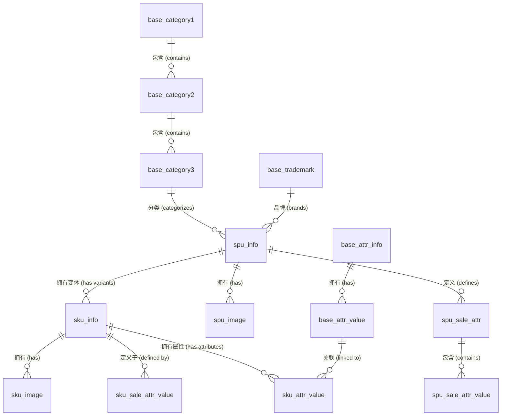
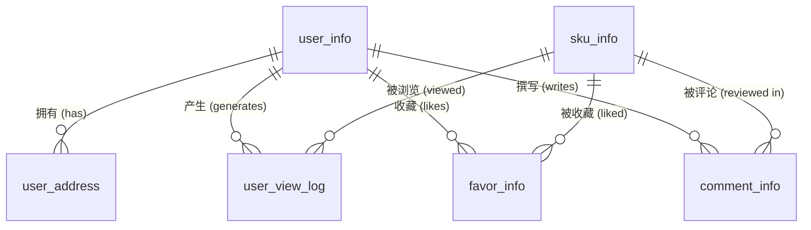
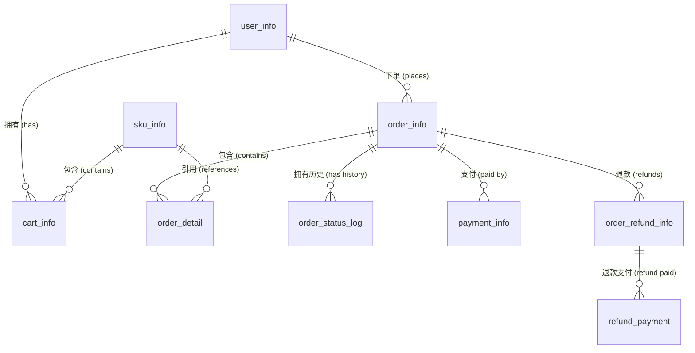
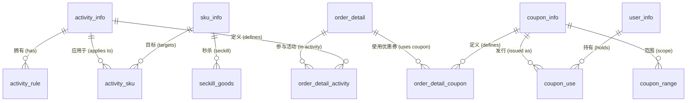
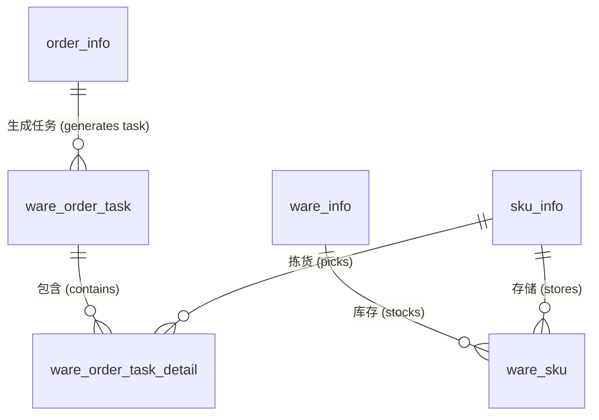

# GMall 数据库设计文档

本文档提供了 `gmall` 数据库架构的全面概述，该数据库专为电子商务平台设计。为了便于理解和维护，架构被划分为几个业务领域。

## 1. 业务领域 (Business Domains)

数据库表按以下业务领域进行分类：

### 1.1 商品领域 (Product Domain)
该领域管理商品信息，包括分类、品牌、属性以及 SKU/SPU 详情。

*   **`base_category1`**: 一级商品分类（例如：电子产品、服装）。
*   **`base_category2`**: 二级商品分类（一级分类的子分类）。
*   **`base_category3`**: 三级商品分类（二级分类的子分类）。
*   **`base_trademark`**: 品牌/商标信息。
*   **`base_attr_info`**: 平台属性定义（例如：颜色、尺寸）。
*   **`base_attr_value`**: 平台属性值。
*   **`base_sale_attr`**: 销售属性定义。
*   **`spu_info`**: 标准产品单元 (SPU) 信息。代表一个产品模型（例如：iPhone 12）。
*   **`spu_image`**: SPU 关联的图片。
*   **`spu_poster`**: SPU 的宣传海报。
*   **`spu_sale_attr`**: SPU 关联的销售属性。
*   **`spu_sale_attr_value`**: SPU 销售属性的值。
*   **`sku_info`**: 库存量单位 (SKU) 信息。代表具体的在售商品（例如：iPhone 12, 128GB, 黑色）。
*   **`sku_image`**: SKU 关联的图片。
*   **`sku_attr_value`**: SKU 关联的平台属性值。
*   **`sku_sale_attr_value`**: 定义 SKU 的销售属性值（例如：红色, XL）。
*   **`comment_info`**: 用户对商品的评价和评论。

### 1.2 用户领域 (User Domain)
该领域处理用户账户、地址和活动日志。

*   **`user_info`**: 用户账户信息（登录名、密码、个人资料）。
*   **`user_address`**: 用户关联的收货地址。
*   **`user_view_log`**: 用户商品浏览日志，用于分析。
*   **`favor_info`**: 用户收藏的商品（收藏夹）。

### 1.3 订单领域 (Order Domain)
该领域管理从创建到支付和退款的订单生命周期。

*   **`order_info`**: 订单主表信息（用户、状态、总金额）。
*   **`order_detail`**: 订单明细表（SKU、数量、价格）。
*   **`order_status_log`**: 订单状态变更历史记录。
*   **`payment_info`**: 支付交易记录。
*   **`order_refund_info`**: 订单退款相关信息。
*   **`refund_payment`**: 退款支付交易记录。
*   **`cart_info`**: 用户购物车商品。

### 1.4 营销与促销领域 (Marketing & Promotion Domain)
该领域涵盖活动、优惠券和促销内容。

*   **`activity_info`**: 营销活动定义。
*   **`activity_rule`**: 定义活动资格和优惠规则。
*   **`activity_sku`**: 活动与具体 SKU 的关联。
*   **`coupon_info`**: 优惠券定义。
*   **`coupon_range`**: 优惠券适用范围（分类、品牌、SPU）。
*   **`coupon_use`**: 用户领取和使用优惠券的记录。
*   **`seckill_goods`**: 参与“秒杀”活动的商品。
*   **`cms_banner`**: 前端内容管理系统的轮播图。
*   **`promotion_pos`**: 促销展示位置定义。
*   **`promotion_refer`**: 外部促销推荐来源。
*   **`order_detail_activity`**: 订单明细与应用活动的关联。
*   **`order_detail_coupon`**: 订单明细与应用优惠券的关联。

### 1.5 库存与物流领域 (Warehouse & Logistics Domain)
该领域管理库存和履约任务。

*   **`ware_info`**: 仓库设施信息。
*   **`ware_sku`**: 特定仓库中 SKU 的库存水平。
*   **`ware_order_task`**: 由订单生成的库存工作单（履约任务）。
*   **`ware_order_task_detail`**: 库存工作单明细（需拣货/打包的 SKU）。

### 1.6 基础数据与配置 (Base Data & Configuration)
该领域包括参考数据和系统配置。

*   **`base_dic`**: 系统通用代码和值的字典表。
*   **`base_province`**: 省份/州参考数据。
*   **`base_region`**: 地理区域参考数据。
*   **`base_frontend_param`**: 前端配置参数。
*   **`entity_mapping`**: 实体映射（例如：搜索同义词）。
*   **`financial_sku_cost`**: SKU 成本信息（用于财务报告）。

## 2. 领域实体关系 (Domain ER Diagrams)

为了更清晰地展示关系，以下按业务领域分别展示 ER 图。

### 2.1 商品领域 ER 图 (Product Domain)

### 2.2 用户领域 ER 图 (User Domain)

### 2.3 订单领域 ER 图 (Order Domain)

### 2.4 营销领域 ER 图 (Marketing Domain)

### 2.5 库存领域 ER 图 (Warehouse Domain)

## 3. 关键关系说明

*   **商品层级**: 分类按 3 级层级组织 (`base_category1` -> `base_category2` -> `base_category3`)。商品 (`spu_info`) 链接到叶子分类 (`base_category3`)。
*   **SPU 与 SKU**: `spu_info` 代表抽象产品（例如：“iPhone 12”），而 `sku_info` 代表具体的在售单元（例如：“iPhone 12, 128GB, 黑色”）。SKU 是 SPU 的变体，由销售属性 (`sku_sale_attr_value`) 定义。
*   **订单处理**: 用户 (`user_info`) 下订单 (`order_info`)。一个订单包含多个明细 (`order_detail`)，每个明细引用一个特定的 SKU (`sku_info`)。
*   **库存**: 库存按仓库按 SKU 进行跟踪 (`ware_sku`)。
*   **促销**: 活动和优惠券可以应用于订单。`order_detail_activity` 和 `order_detail_coupon` 记录了哪些促销活动应用于特定的订单明细。
