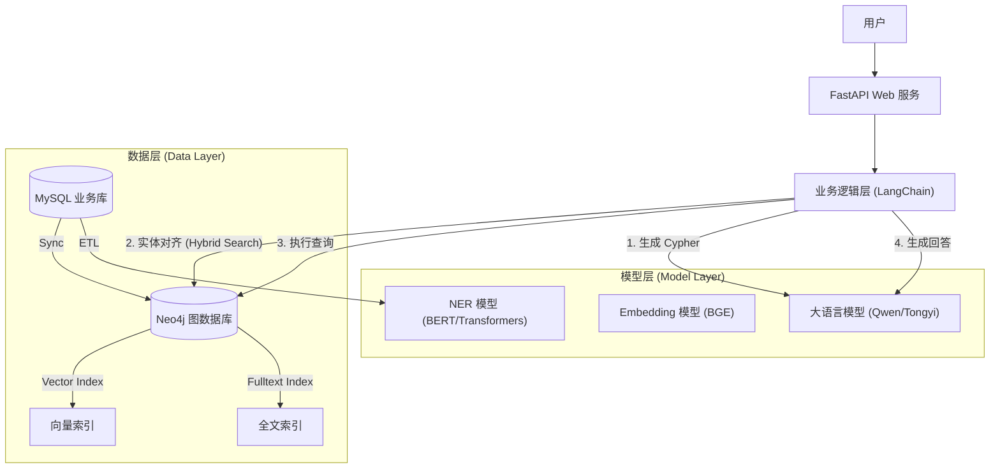
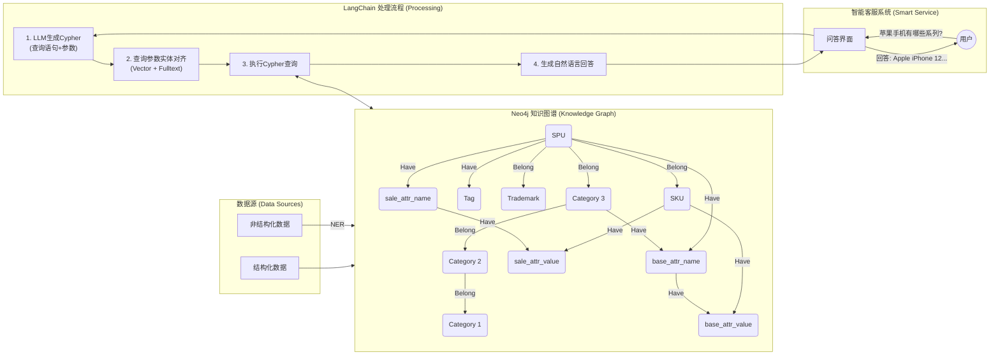

# GMall 知识图谱项目技术指南

本文档旨在为研发人员提供 GMall 知识图谱项目的全面技术概览，涵盖业务背景、技术架构、核心亮点及学习路径。

## 1. 项目背景 (Business Background)

本项目基于 **GMall (通用商城)** 的电商业务场景，构建了一个垂直领域的知识图谱系统。其核心目标是利用图数据库的关联能力和大语言模型 (LLM) 的理解能力，提供智能化的搜索、问答和推荐服务。

### 1.1 核心业务领域
项目围绕以下核心电商实体构建图谱：
*   **商品 (Product)**: 包含三级分类体系 (Category1/2/3)、品牌 (Trademark)、SPU (标准产品单元) 和 SKU (库存单元)。
*   **用户 (User)**: 用户画像、收货地址、浏览/收藏/购买行为。
*   **订单 (Order)**: 交易全链路数据。
*   **营销 (Marketing)**: 活动、优惠券及其与商品的关联。

### 1.2 业务痛点解决
*   **语义搜索**: 解决传统关键词搜索无法理解“夏季透气运动鞋”这类语义查询的问题。
*   **复杂问答**: 支持“查询去年购买过 iPhone 12 的用户主要分布在哪些省份”这类跨实体、多跳跃的复杂分析问题。

---

## 2. 技术架构 (Technical Architecture)

本项目采用了 **GraphRAG (Graph Retrieval-Augmented Generation)** 架构，结合了知识图谱的结构化优势和 LLM 的生成能力。

### 2.1 整体架构图



### 2.2 详细交互流程与图谱 Schema (Detailed Interaction & Schema)

下图展示了从数据入库到用户问答的详细处理流程，以及 Neo4j 内部的核心 Schema 结构：



**流程详解：**

1.  **数据构建 (左侧)**:
    *   **结构化数据**: 直接映射到图谱中的实体（如分类、SPU、SKU）。
    *   **非结构化数据**: 经过 **NER (命名实体识别)** 提取关键信息后注入图谱。
    *   **图谱结构**: 形成了以 **SPU** 为核心，向上关联三级分类，向下关联 SKU 和属性的严密层级结构。

2.  **智能问答 (右侧)**:
    *   用户提问后，系统首先通过 **LLM** 生成参数化的 Cypher 查询。
    *   **关键步骤 - 实体对齐**: 生成的查询参数（如 "苹果手机"）会通过向量检索和全文检索，与图谱中的标准名称（"Apple" 或 "iPhone"）进行对齐，确保查询准确性。
    *   执行查询获取子图或数据结果。
    *   最后再次调用 LLM，结合查询结果生成用户友好的自然语言回复。


### 2.2 核心技术栈

| 组件 | 技术选型 | 说明 |
| :--- | :--- | :--- |
| **Web 框架** | **FastAPI** | 高性能异步 Python Web 框架 |
| **图数据库** | **Neo4j** | 存储商品、用户、订单等实体及其复杂关系 |
| **LLM 编排** | **LangChain** | 管理 Prompt、链式调用和图谱交互 |
| **大模型** | **Qwen (通义千问)** | 通过 DashScope API 调用，负责意图理解和 SQL/Cypher 生成 |
| **Embedding** | **BGE (BAAI/bge-small-zh)** | 中文语义向量化，用于构建向量索引 |
| **NLP/NER** | **Transformers (BERT)** | 训练自定义 NER 模型，用于从非结构化文本中提取电商实体 |

---

## 3. 技术亮点 (Technical Highlights)

### 3.1 基于 GraphRAG 的智能问答
不同于传统的基于文档切片的 RAG，本项目实现了 **GraphRAG**：
*   **Text2Cypher**: 利用 LLM 将自然语言问题转化为 Neo4j 的查询语言 (Cypher)。
*   **动态 Schema 感知**: LLM 在生成查询时会参考图谱的实时 Schema，确保生成的查询语法正确且符合当前数据结构。

### 3.2 混合检索与实体对齐 (Hybrid Search & Entity Alignment)
为了解决用户输入实体名称不准确的问题（如用户输入“苹果手机”但库中存储为“iPhone”），项目实现了**实体对齐**机制：
*   **向量检索 (Vector Search)**: 基于语义相似度召回（解决“红米” vs “Redmi”）。
*   **全文检索 (Fulltext Search)**: 基于关键词模糊匹配。
*   **混合策略**: 结合两者优势，确保即使即使用户输入有误，也能精确映射到图谱中的标准实体节点。

### 3.3 自动化数据同步
*   实现了从关系型数据库 (MySQL) 到图数据库 (Neo4j) 的全量/增量同步脚本 (`src/datasync`)。
*   在同步过程中自动计算并更新节点的 Embedding 向量，确保存储和索引的一致性。

### 3.4 自定义 NER 模型
*   针对电商垂直领域，基于 BERT 微调了命名实体识别 (NER) 模型 (`src/ner`)。
*   能够从用户评论或搜索语句中精准提取“品牌”、“品类”、“商品名”等关键实体，辅助图谱构建和查询理解。

---

## 4. 研发学习路径

建议新加入的研发人员按以下顺序学习项目：

1.  **理解数据模型**: 阅读 `docs/database_design.md`，熟悉 GMall 的 E-R 图，特别是商品分类层级和 SPU/SKU 关系。
2.  **掌握 Neo4j**: 学习 Cypher 查询语言，尝试在 Neo4j Browser 中执行简单的查询（如查询某个品牌下的所有商品）。
3.  **研读核心代码**:
    *   `src/web/service.py`: 核心业务逻辑，重点看 `_generate_cypher` (生成查询) 和 `_entity_align` (实体对齐) 方法。
    *   `src/web/utils.py`: 索引创建逻辑，理解如何构建向量索引。
4.  **运行与调试**:
    *   启动 FastAPI 服务 (`main.py`)。
    *   使用 Postman 或 Swagger UI 测试问答接口，观察控制台输出的 Cypher 语句，理解 LLM 是如何将自然语言转化为图查询的。

---

## 5. 目录结构说明

```
graph/
├── docs/               # 项目文档 (DB设计, BIO标注等)
├── src/
│   ├── conf/           # 配置文件 (DB连接, API Key)
│   ├── datasync/       # 数据同步脚本 (MySQL -> Neo4j)
│   ├── ner/            # NER 模型训练与评估代码
│   └── web/            # Web 服务核心代码
│       ├── controller.py # API 路由
│       ├── service.py    # 核心业务逻辑 (RAG, LLM交互)
│       └── utils.py      # 工具函数 (索引管理)
├── requirements.txt    # 项目依赖
└── main.py             # 程序入口
```
